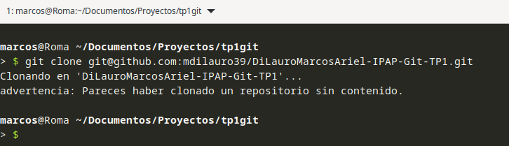
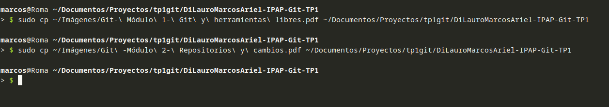
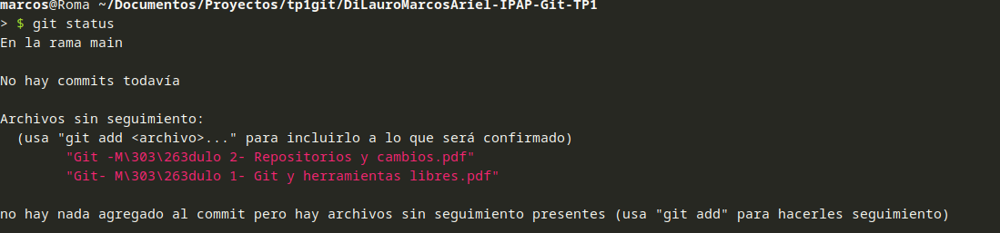
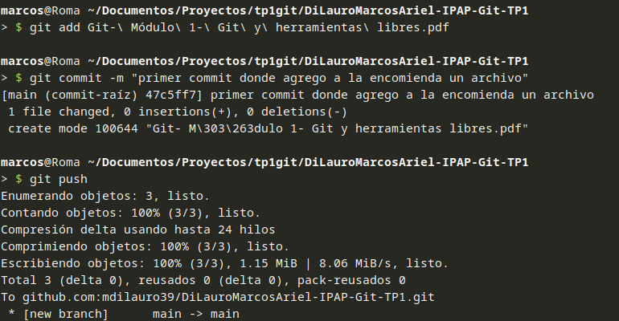
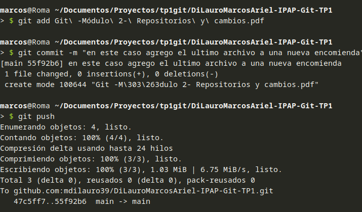

## DIFERENCIAS ENTRE SVN Y GIT

Aunque Suvbersion y Git son versionadores , su funcionamiento interno distan de ser iguales.

> El modo de Versionar  de Subversion esta centralizado en un solo servidor en la nube, el historial se almacena ahi mismo.
> 
> Git en cambio es distribuido, todas las copias tienen el historial completo
> 
> por otro lado Subversion(desde ahora svn) requiere conexion contastnte al servidor mientrsa que GIT se permite el trabajo sin conexion, guardando los cambios locales para finalmente sincronizarse a la nube.
> 
> con respecto a las branches svn crear carpetas dentro del directorio raiz mientras que git no.
> 
> Los comandos tambien tienen difrencia, mientras git usa clone, pull para los cambios mientras en svn se usa checkouts y checkins. en lo que respectya a instantaneas, vcn lo hace por cada archivo de forma inviduvual mientras git lo hace de todo el proyecto.

## DIFERENCIAS ENTRE GITLAB Y GITHUB

> Considero que la gran difrencia es que gitlab esta bsasdo en un nucle abierto como tambien las caracteristica de devops, CI/CD son accesibles desde el modelo gratuito. github tiene una excelente integración con visual code studio.
